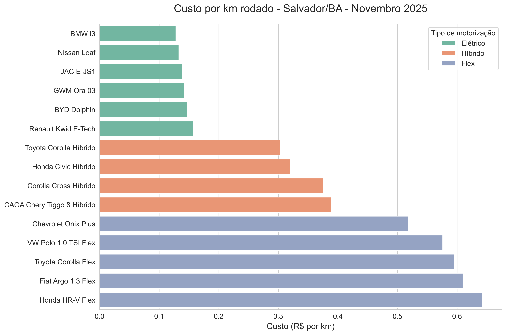
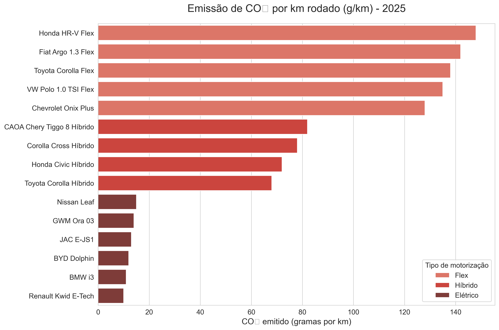

# analise-veiculos-flex-hibrido-eletrico
Custo por km e emissão CO₂ – Flex × Híbrido × Elétrico (Salvador 2025)
# Análise Comparativa: Flex × Híbrido × Elétrico 2025

Comparação real de **custo por km rodado** e **emissão de CO₂** considerando preços de combustível e energia elétrica em Salvador-BA (novembro 2025).

## Resultados principais
- Carros 100 % elétricos: R$ 0,13 – 0,16 por km  
- Híbridos: R$ 0,30 – 0,39 por km  
- Flex: R$ 0,52 – 0,64 por km → até **5× mais caro**  
- Elétricos emitem até **92 % menos CO₂** que flex

## Gráficos

### Custo por km rodado

### Emissão de CO₂ por km

## Tecnologias utilizadas
- Python  
- Pandas (leitura e manipulação de dados)  
- Seaborn + Matplotlib (visualização profissional)  
- Exportação automática para Excel

## Arquivos do repositório
- `veiculos.py` → código completo e comentado  
- `dados_veiculos.csv` → base com 15 modelos reais  
- `Resultado_Final_Veiculos_2025.xlsx` → tabela final  
- duas imagens em alta resolução

## O que aprendi com esse projeto
- Leitura e tratamento de arquivos CSV com pandas  
- Criação de variáveis derivadas (feature engineering básico)  
- Cálculo de indicadores de negócio (custo por km)  
- Visualização comparativa com cores e ordenação inteligente  
- Boas práticas de organização de código e salvamento automático de resultados  
- Exportação de dados para Excel de forma automatizada  
- Estruturação profissional de repositório GitHub (README claro, imagens, planilha)

Esse projeto me ajudou a consolidar habilidades essenciais para atuação em **Ciência de Dados, Análise de Negócios e áreas de Crédito/Cobrança**.

Feito por **Eduardo Rodrigues dos Santos**  
Estudante de Big Data e Inteligência Artificial – UNIFACS  
Camaçari/Dias d’Ávila – BA  
(71) 98611-2735 | Eduardorodriguesxpro@gmail.com  
LinkedIn: https://www.linkedin.com/in/eduardo-ramos-a9b927180/

⭐ Se gostou, deixa uma estrela no repositório!
